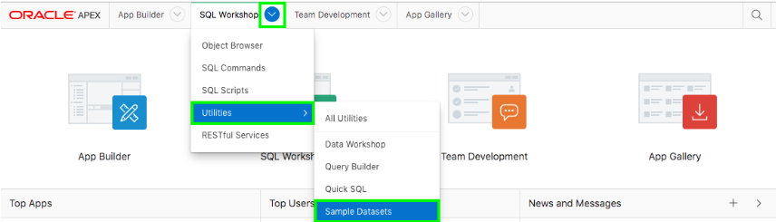
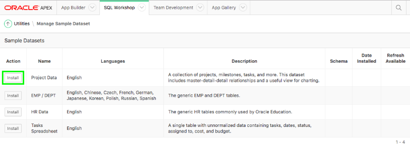

## Module 2

## Building your tables and view - Installing Sample Tables

### **Part 1** - Logging In

- In  the main menu, select **SQL Workshop**, select **Utilities**, click **Sample Datasets**.  

### **Part 2** - Creating the EMP and DEPT Tables

- On the Project Data row, click **Install**.  

- Click **Next**.
- Click **Install Dataset**.
- Click **Exit**.    
*{We do not want to create an application directly on the tables}*

### **Part 3** - Review Database Objects

- In the App Builder Menu, select **SQL Workshop**, and click **Object Browser**.  

- Click on the tables and the various tabs (such as Data, Constraints, etc.) to review the table details.  
.PNG)

## Summary

To be added. [Click here to navigate to Module 2](2-building-your-app-using-the-create-application-wizard.md)  
