## Module 2

## Building your app - Using the Create Application Wizard

### **Part 1** - Creating an App

- In the App Builder menu, click **App Builder**.
- Click **Create**
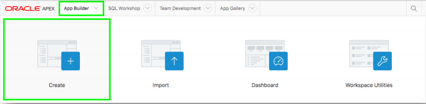

### **Part 2** - Selecting App Type

- Click **New Application**.
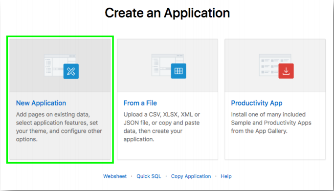

### **Part 3** - Naming the App
- For Name enter **Projects**.
- Click **Appearance**.  
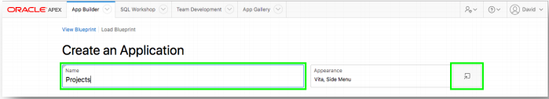
- For Theme Style select **Vita – Slate**.
- Click **Choose New Icon**.
- Select the icon color and an icon.
- Click **Set Application Item**.
- Click **Save Changes**. 

.PNG)

### **Part 4** – Add the Dashboard Page

- Click **Add Page**.
- Click **Dashboard**.

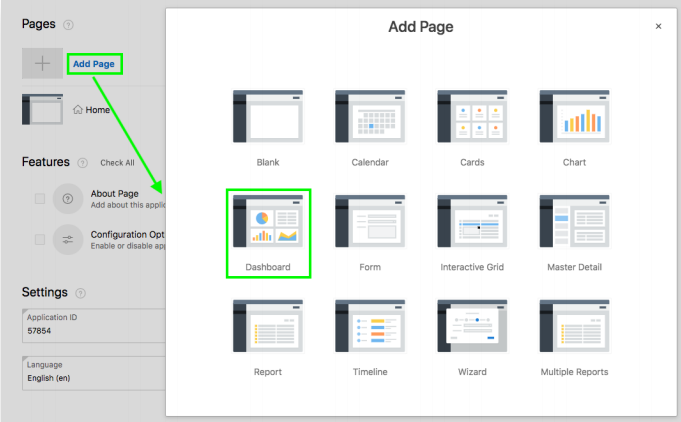

- For Chart 1, enter the following:
   - Chart Type – select **Bar**.
   - Chart Name – enter **Budget versus Cost**.
   - Table or View – select **SAMPLE$PROJECTS_V**.
   - Label Column – select **NAME**.
   - Value Column – select **BUDGET_V_COST**.

 .PNG) 

- For Chart 2, enter the following:
   - Chart Type – select **Pie**.
   - Chart Name – enter **Project Status**.
   - Table or View – select **SAMPLE$PROJECTS_V**.
   - Label Column – select **Status**.
   - Type – select **Count**.  
.PNG)  

- For Chart 3, enter the following:
   - Chart Type – select **Bar**.
   - Chart Name – enter **Project Leads**.
   - Table or View – select **SAMPLE$PROJECTS_V**.
   - Label Column – select **PROJECT_LEAD**.
   - Type – select **Count**.
- Click **Add Page**.  
.PNG)  

### **Part 5** – Add the Project Page

- Click **Add Page**.
- Click **Cards**.
- Enter the following:
   - Page Name - enter **Projects**.
   - Table - select **SAMPLE$PROJECTS**.
   - Card Title - select **NAME**.
   - Description - select **Description**.
   - Additional Text - select **PROJECT_LEAD**.
- Click **Add Page**.

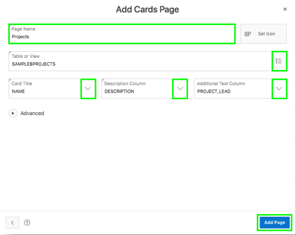 

### **Part 6** - Add the Milestone Pages

- Click **Add Page**.
- Click **Report**.
- Enter the following:
  - Page Name - enter **Milestones**.
  - Table - select **SAMPLE$PROJECT_MILESTONES**.
  - Check **Include Form**. 
  - Lookup Key 1 - select **PROJECT_ID**.
  - Display Col 1 - select **SAMPLE$PROJECTS.NAME**.
- Click **Add Page**.  
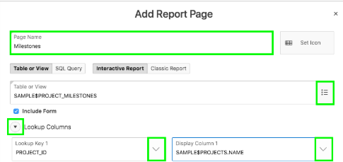

### **Part 7** - Add the Task Pages

- Click **Add Page**.
- Click **Report**.
- Enter the following:
  - Page Name - enter **Tasks**. 
  - Table - select **SAMPLE$PROJECT_TASKS**.
  - Check **Include Form**. 
  - Lookup Key 1 - select **PROJECT_ID**.
  - Display Col 1 - select **SAMPLE$PROJECTS.NAME**.
  - Lookup Key 2 - select **MILESTONE_ID**. 
  - Display Col 2 - select **SAMPLE$PROJECT_MILESTONES.NAME**.
- Click **Add Page**.  
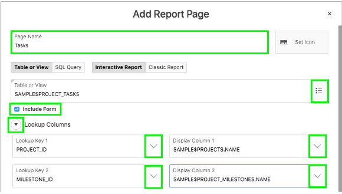

### **Part 8** – Add a Calendar Page

- Click **Add Page**.
- Click **Calendar**.
- Enter the following:
  - Page Name - enter **Tasks Calendar**.
  - Table - select **SAMPLE$PROJECT_TASKS**.
  - Display Column - select **NAME**.
  - Start Date Column - select **START_DATE**.
  - End Date Column - select **END_DATE**.
- Click **Add Page**.  
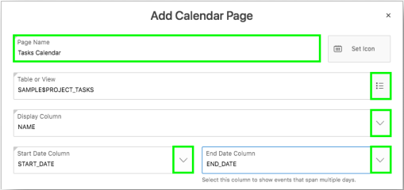

### **Part 9** – Include All Features

- Next to Features, click **Check All**.  
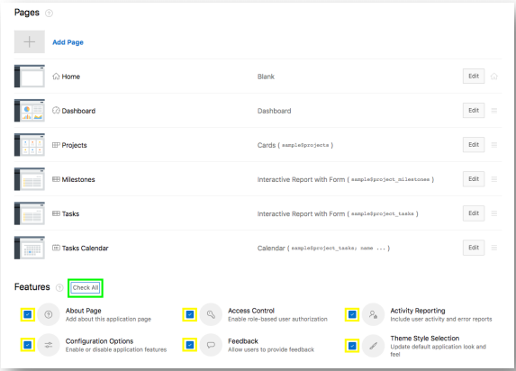
- Click **Create Application**.

### **Part 10** - App in Page Designer

- Your new application will be displayed in Page Designer.
- Click **Run Application**.
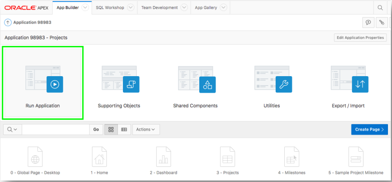

### **Part 11** – Runtime App

- Enter your user credentials.
- Play around with your new application.

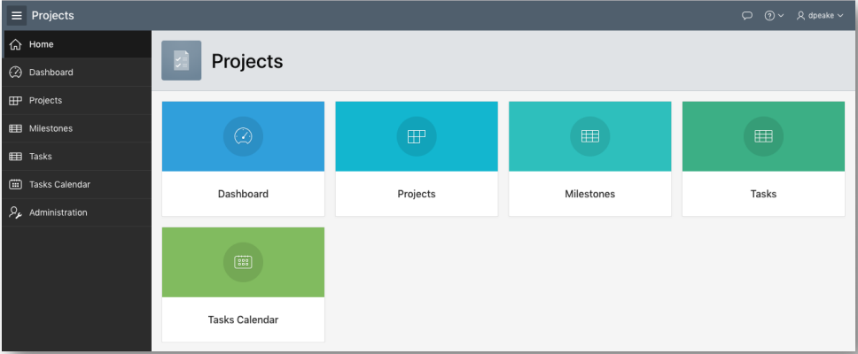

To be added. [Click here to navigate to Module 3](3-recreating-the-app-improving-the-generated-app.md)  
