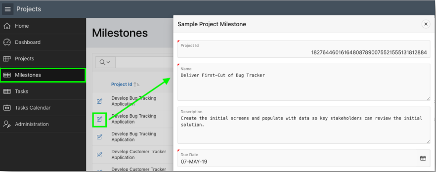
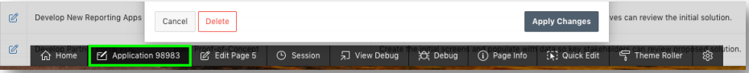
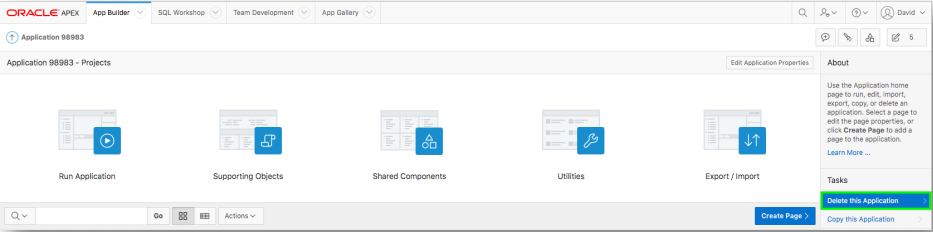
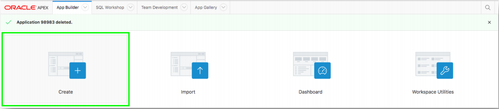
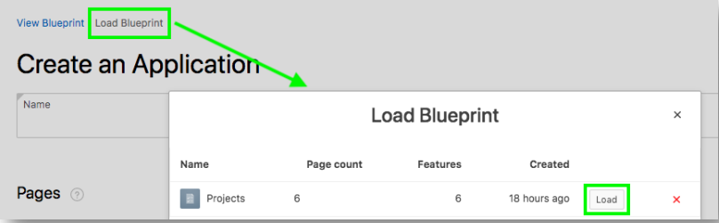
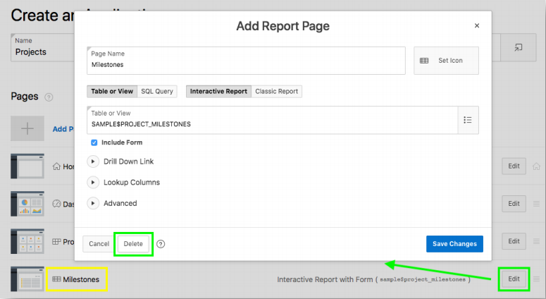
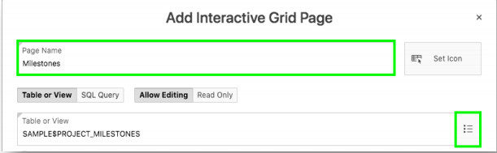
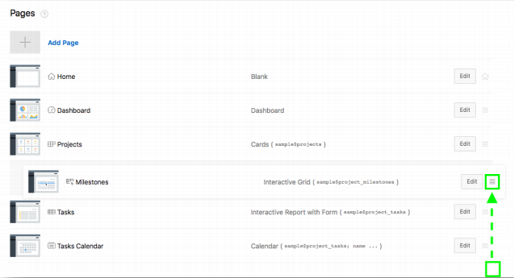
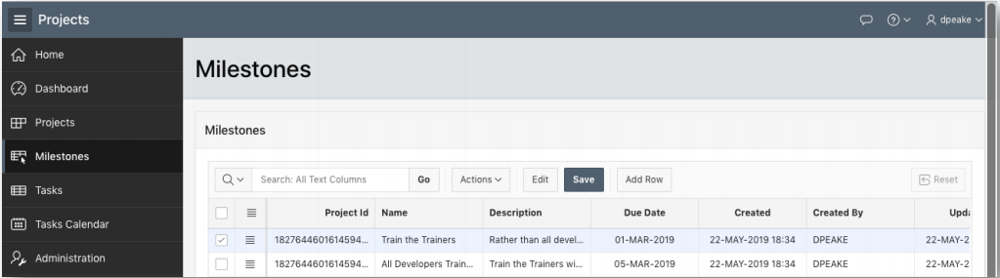

## Module 3

## Recreating the App - Improving the Generated App

### **Part 1** - View Milestone Form

- In the runtime environment, within the menu, click **Milestones**.
- Click the edit icon for a Milestone.  
*Notice that there are only a few items – An Interactive Grid may work better.*

### **Part 2** – Return to the App Builder

- In the runtime environment, within the develop toolbar, click **Application xxxxx**.  
  
*Note: The Developer Toolbar is only shown to developers who run the application from the App Builder. End users will never be shown the Developer Toolbar.*

### **Part 3** - Delete the App

- From the App Home Page, under Tasks, click **Delete this application**.  
  
- Click **Permanently Delete Now**.

### **Part 4** - Create a new App

- From the App Builder Home Page, click **Create**.  
 
- Click **New Application**.

### **Part 5** - Load Blueprint

- Click **Load Blueprint**.
- For the latest app generated, click **Load**.  
  
*The previously defined app definition will be displayed*.

### **Part 6** - Delete the Milestones Report

- In the list of pages, for Milestones, click **Edit**.
- Click **Delete**.  

### **Part 7** - Add a new Milestone Page

- Click **Add Page**.
- Click **Interactive Grid**.
- Enter the following:
  - Page Name - enter **Milestones**.
  - Table - select **SAMPLE$PROJECT_MILESTONES**.
- Click **Add Page**.  

### **Part 8** - Reorder the pages

- In the list of Pages, for the Milestones page, select the hamburger.
- Drag the page up until it is under the Projects page and drop.

- Click **Create Application**.

### **Part 9** - App in Page Designer

- Your new application will be displayed in Page Designer.
- Click **Run Application**.
- Enter your user credentials.
- Navigate to **Milestones**.

To be added. [Click here to navigate to Module 4](4-using-page-designer-updating-the-milestones-page.md)  
