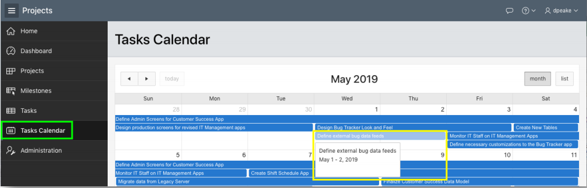
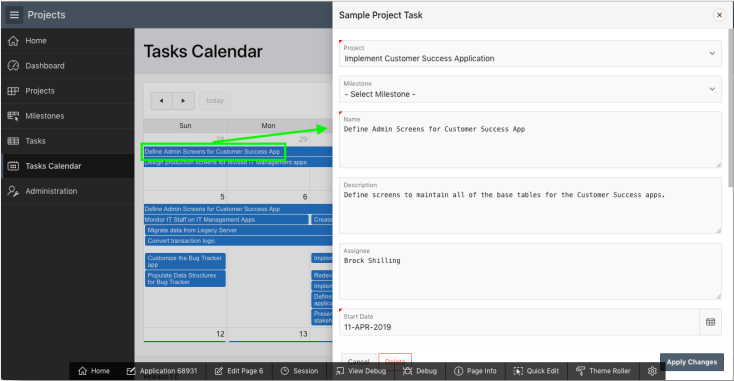

## Module 7

## Linking pages - Link the Calendar to the Tasks Form Page

### **Part 1** - Adding a Link

- In the runtime environment, within the Navigation Menu, click **Tasks Calendar**.
- Clicking on any entry simply displays the event details.

- In the Developer Toolbar (bottom of page), click **Edit Page 7**.
- In Page Designer, within the Rendering tree (left pane), under **Tasks Calendar** region, click **Attributes**.
- For Settings > View / Edit Link click **No Link Defined**.
- In the Link Builder, enter the following:
   - Target > Page select **6**.
   - Set Items > Name select **P6_ID**.
   - Set Items > Value select **ID**. {Returns **&ID**.}
   - Clear Cache enter **6**.
- Click **OK**.
- Click **Save**.

.PNG)

### **Part 2** - Run the Application

- Navigate back to the runtime environment, and refresh the browser.
- Click a calendar entry.

## Summary

To be added.

- APEX on Autonomous  https://apex.oracle.com/autonomous
- APEX Collateral  http://apex.oracle.com
- Tutorials  https://apex.oracle.com/en/learn/tutorials
- Community  http://apex.oracle.com/community
- External Site + Slack  http://apex.world
