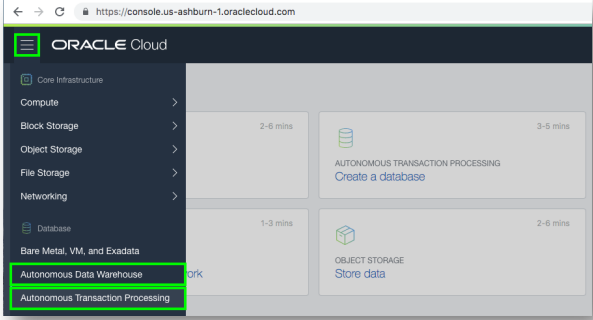
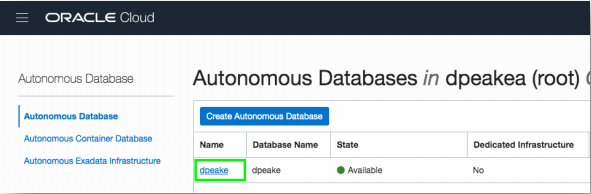
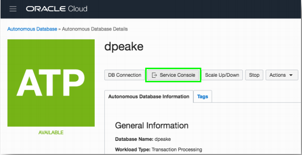
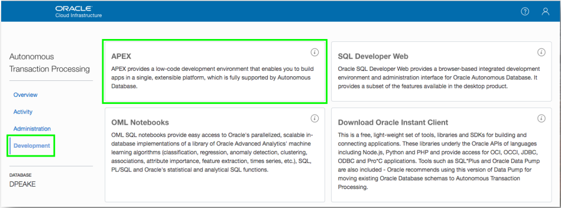
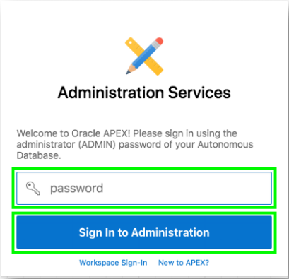
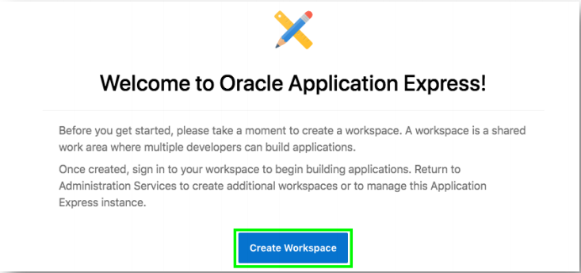
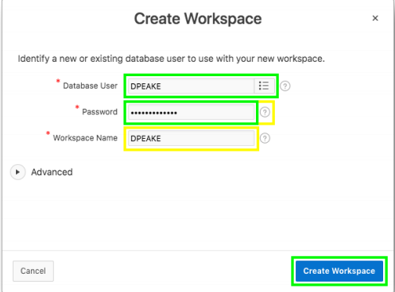
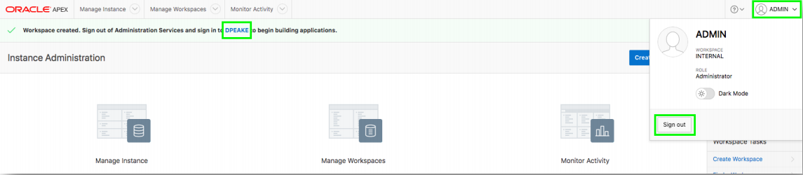
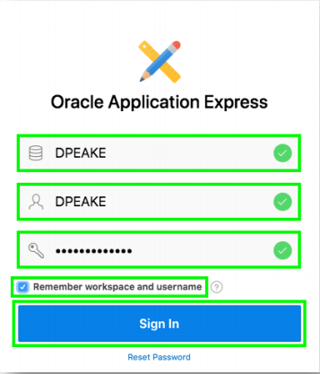

# Creating an App based on Existing Tables for Oracle Autonomous Cloud Service

This lab walks you through uploading a spreadsheet into an Oracle database table, and then creating an application based on this new table. You will then play with the Interactive Report and improve the attached form. Lastly, you will add a Calendar page and then link it to the existing form page.

*Rather than trying to email a spreadsheet to gather information from different people, simply create an app in minutes, and email the URL. This single source-of-truth, multi-user, secured, scalable app is so much better than having 20 (incomplete) spreadsheets!*

Please note this lab assumes that you already have the Autonomous Data Warehouse (ADW) or Autonomous Transaction Processing – Serverless (ATP-S) service provisioned. 

If you do not currently have a cloud service, sign up for a free trial account at https://cloud.oracle.com/try-autonomous-database

## Lab Objectives

To be added.

## Lab Modules

| # | Module | Est. Time |
| --- | --- | --- |
| 1 | [Installing Sample Tables](1-building-your-table-and-view-installing-sample-tables.md) | 5 min |
| 2 | [Using the Create Application Wizard](2-building-your-app-using-the-create-application-wizard.md) | 20 min |
| 3 | [Improving the Generated App](3-recreating-the-app-improving-the-generated-app.md) | 30 min |
| 4 | [Updating the Milestones Page](4-using-page-designer-updating-the-milestones-page.md) | 30 min |
| 5 | [Add the Project Form Page](5-creating-a-page-to-update-project-records-add-the-project-form-page.md) | 30 min |
| 6 | [Updating the Task Pages](6-improving-usability-updating-the-task-pages.md) | 30 min |
| 7 | [Link the Calendar to the Tasks Form Pages](7-linking-pages-link-the-calendar-to-the-tasks-form-pages.md) | 30 min |

## Parts

### **Part 1** - Accessing APEX
1. Sign into your **Oracle Cloud service**.
2. Click the **Navigation Menu** (top left), select **Autonomous Data Warehouse** or **Autonomous Transaction Processing**, based on which service(s) you have defined.

    

3. Click < **Your Database** > from the **list**.

    

4. Click **Service Console**.

    

5. Click **Development** on the left, then Click **APEX**.

    

### **Part 3** - Creating a Workspace

1. To sign into **APEX Administrative Services** (for Password enter your OCI Password) and Click **Sign In to Administration**.

    

3. Given this is your first time entering APEX, click **Create Workspace**.

    

4. Enter appropriate name for **Database User**, enter **new password** and then, click **Create Workspace**. 

      
    *Note: The Database User will be used for the Workspace Name. If you want you can update the Workspace Name. Click the **?** Icon       to see password complexity rules*

### **Part 4** – Log into your New Workspace

1. Click on the link within the success message. {easiest technique} OR
2. Click on the Admin user (top right), click **Sign Out**, and then click **Return to Sign In Page**.

    

3. Sign into your new **Workspace**.
    - Workspace – enter **Your Workspace Name**
    - Username – enter **Your Database User**
    - Password – enter your OCI Password  
    *Remember workspace and username - Check*
4. Click **Sign In**. 

      
    *{Note: Enter the Workspace Name and Database User entered in Part 3-6 above}*

To be added. [Click here to navigate to Module 1](1-building-your-table-and-view-installing-sample-tables.md)

